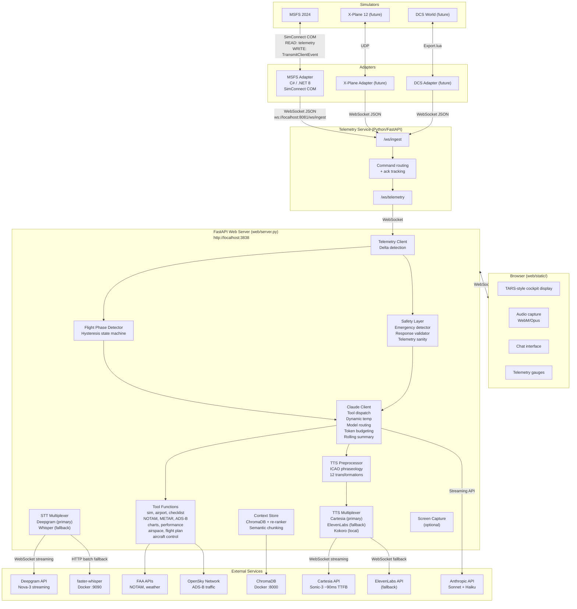
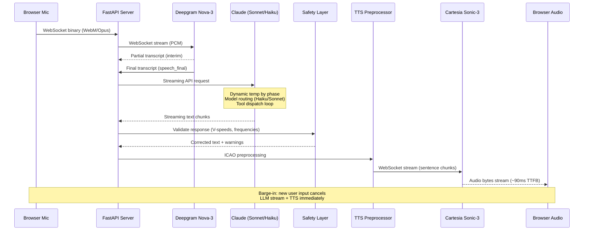

# MERLIN v2.0 -- Architecture Documentation

Technical deep-dive into MERLIN's system design, component responsibilities, data flows, and implementation decisions.

---

## System Overview



---

## Data Flow: Simulator Telemetry

```
MSFS 2024
  -> SimConnect COM API (native Windows)
  -> SimConnectManager (C#)
       Event-driven message pump: EventWaitHandle signals when data ready
       Dedicated pump thread calls ReceiveMessage() on signal
       High-frequency data (per sim frame, when changed): position, attitude, speeds
       Low-frequency data (1 Hz): autopilot, radios, fuel, surfaces, environment, engines
  -> Assembles SimState object (thread-safe, locked)
  -> Fires StateUpdated event
  -> TelemetryServiceClient serializes to JSON (snake_case)
  -> Pushes to telemetry service via WebSocket (/ws/ingest)
  -> Telemetry service broadcasts to consumers via /ws/telemetry
  -> TelemetryClient (Python) receives via websockets library
  -> Delta detection: only fires callbacks when values actually change
  -> Telemetry sanity checks (validation.py): rejects impossible values
  -> Deserializes into Pydantic SimState model
  -> FlightPhaseDetector evaluates telemetry, updates phase (with hysteresis)
  -> EmergencyDetector evaluates for engine failure, fire, decompression
  -> FastAPI WebSocket relays telemetry to browser for real-time gauge display
```

---

## Data Flow: Aircraft Control Commands

```
Pilot (voice or text)
  -> "Merlin, give me flaps at 20"
  -> Deepgram Nova-3 streaming STT (or Whisper batch fallback)
  -> ClaudeClient interprets intent
  -> Claude calls tool: set_aircraft_control(system="flaps", action="2")
  -> tools.py: _resolve_command() maps to SimConnect event ("FLAPS_2", 0)
  -> sim_client.py: send_command() sends JSON via WebSocket to telemetry service
       {"type": "command", "command_id": "<uuid>", "adapter_id": "msfs-adapter",
        "command": "FLAPS_2", "value": 0}
  -> Telemetry service routes command to target adapter WebSocket
  -> MSFS adapter: TelemetryServiceClient receives command in ReceiveLoopAsync
  -> SimConnectManager.ExecuteCommand() calls TransmitClientEvent()
  -> SimConnect COM API sets flaps in the sim
  -> Adapter sends command_ack back through telemetry service to orchestrator
  -> Tool returns result to Claude, MERLIN responds: "Flaps two, set."
```

Supported control systems: flaps, gear, autopilot (heading/altitude/VS/speed/nav/approach),
throttle, radios (COM1/COM2/NAV1/NAV2), barometer, trim, parking brake, spoilers, mixture, propeller.

Safety: Critical commands (gear, AP master) trigger a `safety_note` in the tool result.
The tool description instructs Claude to confirm critical actions with the pilot.

---

## Data Flow: Voice Pipeline (v2)



### STT Path (v2)

The primary STT backend is **Deepgram Nova-3** via WebSocket streaming, replacing the v1 batch-mode faster-whisper pipeline:

1. Browser captures audio as WebM/Opus via MediaRecorder
2. WebSocket binary frames sent to FastAPI server
3. Server forwards PCM audio to Deepgram's streaming WebSocket (`DeepgramSTTClient` in `orchestrator/stt/deepgram.py`)
4. Deepgram returns partial (interim) transcripts as the user speaks
5. `speech_final` event signals end-of-utterance (configurable `endpointing_ms`, default 300ms)
6. Aviation keyword boosting via Deepgram's `keywords` parameter (ATIS, METAR, squawk, NATO phonetic, etc.)

**Fallback:** If `stt_backend=whisper` in config, the system falls back to the v1 batch pipeline (faster-whisper HTTP API at `localhost:9090` with the `WhisperClient`).

### TTS Path (v2)

The primary TTS backend is **Cartesia Sonic-3** via WebSocket streaming, replacing v1 ElevenLabs:

1. Claude's streaming response text is preprocessed by the TTS preprocessor (`tts_preprocessor.py`)
2. ICAO-compliant transformations applied (12 total, see below)
3. Text is buffered at sentence boundaries and sent to Cartesia WebSocket (`CartesiaClient` in `orchestrator/tts/cartesia.py`)
4. Audio chunks stream back at ~90ms time-to-first-byte
5. Audio forwarded to browser via WebSocket for immediate playback

**Fallbacks:** `tts_backend=elevenlabs` (ElevenLabs WebSocket streaming) or `tts_backend=local` (Kokoro local TTS).

### TTS Preprocessor: ICAO Transformations

The TTS preprocessor (`orchestrator/orchestrator/tts_preprocessor.py`) applies 12 aviation-specific text transformations before synthesis:

| # | Transformation | Example Input | Example Output |
|---|---|---|---|
| 1 | Flight level | FL350 | flight level tree five zero |
| 2 | Heading | heading 270 | heading two seven zero |
| 3 | Bearing/radial | the 270 radial | the two seven zero radial |
| 4 | Squawk code | squawk 7700 | squawk seven seven zero zero |
| 5 | QNH/altimeter (inHg) | 29.92 | two niner niner two |
| 6 | QNH (hPa/mb) | 1013 hectopascals | one zero one tree hectopascals |
| 7 | Frequency (contextual) | contact tower 118.7 | one one eight point seven |
| 8 | Frequency (standalone) | 121.5 | one two one point five |
| 9 | Zulu time | 1430Z | one four tree zero Zulu |
| 10 | Runway designator | runway 27L | runway two seven left |
| 11 | ATIS information | Information A | Information Alpha |
| 12 | Transponder mode | Mode C | Mode Charlie |

Additional transformations: speed (knots), altitude (feet), distance (DME), temperature (digit-by-digit), aviation acronyms, and markdown/special character stripping.

---

## Safety Layer (v2)

MERLIN v2 adds a dedicated safety layer (`orchestrator/orchestrator/emergency.py` and `orchestrator/orchestrator/validation.py`) with three components:

### Emergency Fast Paths

The `EmergencyDetector` class monitors consecutive `SimState` snapshots for emergency conditions:

| Emergency Type | Detection Criteria | Response |
|---|---|---|
| `ENGINE_FAILURE_TAKEOFF` | RPM drops below threshold during takeoff/climb phase | Immediate: wings level, pitch for glide, identify landing site |
| `ENGINE_FAILURE_CRUISE` | RPM drops below threshold during cruise/descent/approach | Immediate: pitch for glide, trim, attempt restart |
| `ENGINE_FIRE` | EGT exceeds 1500F with running engine | Immediate: mixture cutoff, fuel off, master off |
| `ELECTRICAL_FIRE` | Electrical anomaly detected | Immediate: master off, all switches off, vents open |
| `RAPID_DECOMPRESSION` | Cabin altitude exceeds 10,000 ft | Immediate: oxygen masks, idle thrust, speedbrake, emergency descent |

Emergency responses are **pre-validated** and delivered immediately via TTS, bypassing LLM inference for time-critical situations. The emergency context is also injected into Claude's system prompt for follow-up situational reasoning.

Detection uses debouncing (`min_detection_duration`, default 0.5s) to prevent false positives from telemetry glitches.

### Response Validation

The `ResponseValidator` class (`validation.py`) scans Claude's responses for aviation-critical numbers:

- **V-speed validation:** Extracts V-speed mentions (Vs0, Vs1, Vfe, Vno, Vne, Vr, Vx, Vy, Vglide) and cross-references against a built-in aircraft database (C172, C152, PA28, SR22, DA40, B738, A320). Flags discrepancies beyond 10% tolerance.
- **Frequency validation:** Checks that frequencies fall within valid aviation bands (108.0-136.975 MHz comm/nav, 200-400 MHz military UHF).
- **Severity levels:** `warning` (logged) vs. `critical` (appended as correction to the response text).

### Telemetry Sanity Checks

The `check_telemetry_sanity()` function validates incoming SimConnect data for impossible values:

- Altitude below -1500 ft MSL or AGL below -100 ft
- Mach > 2.0 for GA aircraft, IAS negative or > 800 kt
- Latitude outside +/-90, longitude outside +/-180
- Negative RPM, oil temperature > 500 degrees

### Tool Timeouts

Every tool call is wrapped in `asyncio.wait_for()` with per-tool timeout configuration:

| Tool | Timeout |
|---|---|
| `get_sim_state` | 2.0s |
| `lookup_airport` | 10.0s |
| `search_manual` | 5.0s |
| `get_checklist` | 5.0s |
| `create_flight_plan` | 10.0s |
| `set_aircraft_control` | 5.0s |

Timed-out tools return an error dict to Claude, which can retry or inform the pilot.

---

## LLM Optimization (v2)

### Dynamic Temperature by Flight Phase

Temperature is no longer a static config value. The `get_temperature_for_context()` function in `claude_client.py` selects a temperature tier based on the current flight phase:

| Tier | Temperature | Phases |
|---|---|---|
| Critical | 0.1 | TAKEOFF, APPROACH, LANDING |
| Normal | 0.3 | CLIMB, DESCENT, TAXI |
| Relaxed | 0.5 | PREFLIGHT, CRUISE, LANDED |

Emergency, short, and briefing query types always use the normal (0.3) temperature for deterministic responses regardless of phase.

### Haiku/Sonnet Model Routing

The `get_model_for_query()` function routes queries to the appropriate model:

- **Short queries** ("roger", "yes", "say again") route to `claude_model_fast` (default: `claude-haiku-4-5-20251001`) for lower latency and cost.
- **All other queries** (normal, briefing, emergency) route to `claude_model` (default: `claude-sonnet-4-20250514`).

Query classification is performed by `classify_query()`, which now recognizes four categories: `emergency`, `short`, `briefing`, `normal`.

### Rolling Conversation Summary

Long flights accumulate conversation history that exceeds the context window. Every `summary_interval` turns (default: 10), if the conversation exceeds `max_history`, MERLIN generates a rolling summary of trimmed messages using the fast model (Haiku):

1. Extract the oldest messages that will be trimmed
2. Send to Haiku with instructions to preserve: diversion plans, weather briefings, clearances, altitude/heading assignments, fuel state, and problems discussed
3. Inject the summary into the system prompt under `--- FLIGHT SESSION SUMMARY ---`
4. Previous summaries are included as context for continuity

This preserves flight-relevant decisions without consuming the full context window.

---

## RAG Pipeline (v2)

### Aviation-Aware Semantic Chunking

The `AviationChunker` class (`orchestrator/orchestrator/chunking.py`) replaces the v1 character-based splitter with structure-aware chunking:

- **Section detection:** Identifies section boundaries via markdown headings, numbered subsections, POH section headers (`NORMAL PROCEDURES`, `EMERGENCY PROCEDURES`, `LIMITATIONS`, etc.)
- **Atomic units:** Checklist items, procedure steps, and limitation entries are never split mid-item
- **Paragraph-aware:** Falls back to paragraph and sentence boundaries for prose sections
- **Configurable:** `max_chunk_chars=1500`, `min_chunk_chars=100`, `overlap_chars=100`

### Cross-Encoder Re-ranking

Two-stage retrieval in `ContextStore.query()`:

1. **Stage 1 (Vector similarity):** Retrieve top-K candidates from ChromaDB (default K=20)
2. **Stage 2 (Cross-encoder):** Re-rank candidates with `cross-encoder/ms-marco-MiniLM-L-6-v2` and return top-N (default N=5)

The `CrossEncoderReranker` class (`orchestrator/orchestrator/reranker.py`) lazy-loads the model on first use and degrades gracefully if `sentence-transformers` is not installed.

### Enhanced Metadata

The context store now tracks richer metadata per chunk:

| Field | Description |
|---|---|
| `document_type` | POH, checklist, AIM, regulation |
| `section` | systems, limitations, procedures, performance |
| `aircraft_type` | C172, B738, etc. |
| `aircraft_variant` | C172S, 737-800, etc. |
| `source_page` | Page number in source document |
| `chunk_index` | Position within the document |

---

## Aviation Tools (v2)

MERLIN v2 adds six new tools in `orchestrator/orchestrator/aviation_tools.py`, in addition to the existing six in `tools.py`:

### Existing Tools (v1)

| Tool | Description | Source |
|---|---|---|
| `get_sim_state` | Current simulator telemetry | `tools.py` |
| `lookup_airport` | Airport info from FAA database | `tools.py` |
| `search_manual` | RAG search over ingested documents | `tools.py` |
| `get_checklist` | Phase-appropriate checklist | `tools.py` |
| `create_flight_plan` | Generate a flight plan | `tools.py` |
| `set_aircraft_control` | Control aircraft systems via SimConnect | `tools.py` |

### New Tools (v2)

| Tool | Description | Source | API |
|---|---|---|---|
| `get_notams` | Fetch NOTAMs for an airport | `aviation_tools.py` | FAA NOTAM API |
| `get_weather` | METAR and TAF weather data | `aviation_tools.py` | aviationweather.gov |
| `get_adsb_traffic` | Nearby ADS-B traffic targets | `aviation_tools.py` | OpenSky Network |
| `get_charts` | Airport chart references (SID/STAR/IAP) | `aviation_tools.py` | FAA DTPP via aviationapi.com |
| `calculate_performance` | Takeoff/landing performance estimates | `aviation_tools.py` | Built-in database (C172, C152, PA28) |
| `get_airspace_info` | Airspace classification at position | `aviation_tools.py` | Simplified built-in logic |

All external API calls use `httpx.AsyncClient` with a 10-second timeout. The performance calculator applies altitude, temperature (ISA deviation), and weight corrections to base performance figures.

---

## Component Descriptions

### MSFS Adapter (`adapters/msfs/`)

| File | Responsibility |
|---|---|
| `SimConnectManager.cs` | SimConnect lifecycle, event-driven message pump, data definition registration, auto-reconnect on MSFS crash/restart |
| `TelemetryServiceClient.cs` | WebSocket client pushing telemetry to the telemetry service, receives commands |
| `Models/SimState.cs` | Telemetry data model: position, attitude, speeds, engines, fuel, autopilot, radios, environment, surfaces |
| `Models/SimDataStructs.cs` | C# struct definitions matching SimConnect data layout for marshalling |
| `Program.cs` | Entry point, wires up manager + service client, handles graceful shutdown |

**Key design:** The message pump uses an `EventWaitHandle` instead of a timer. SimConnect signals the handle when data arrives; the pump thread wakes, calls `ReceiveMessage()`, and goes back to sleep. This replaced a timer-based approach that caused `0x80004005` COM errors from unsynchronized polling.

### Telemetry Service (`telemetry-service/`)

| File | Responsibility |
|---|---|
| `telemetry/service.py` | FastAPI app with `/ws/ingest` and `/ws/telemetry` WebSocket endpoints |
| `telemetry/schema.py` | Universal data models (`TelemetryEnvelope`) |
| `telemetry/adapter_protocol.py` | Adapter-to-service message types |
| `telemetry/adapter_manager.py` | Adapter tracking, consumer broadcast, command routing with ack tracking |
| `telemetry/config.py` | Service configuration |

### Orchestrator (`orchestrator/orchestrator/`)

| File | Responsibility |
|---|---|
| `config.py` | `pydantic-settings` `BaseSettings` class; all config from `.env`; v2 adds STT/TTS backend selection, Deepgram/Cartesia settings, model routing, dynamic temperature tiers, summary interval |
| `sim_client.py` | WebSocket client for telemetry service; Pydantic models; `HealthMonitor`; delta detection |
| `claude_client.py` | Anthropic API wrapper; MERLIN persona; dynamic temperature by phase; Haiku/Sonnet model routing; rolling conversation summary; tool timeouts; emergency query classification |
| `flight_phase.py` | `FlightPhaseDetector` state machine with configurable `PhaseThresholds`; hysteresis (3 consecutive detections before transition) |
| `context_store.py` | ChromaDB RAG store; aviation-aware semantic chunking; cross-encoder re-ranking; enhanced metadata; `_QueryCache` with 60s TTL |
| `chunking.py` | `AviationChunker` class: structure-aware document chunking preserving checklists, procedures, and limitations as atomic units |
| `reranker.py` | `CrossEncoderReranker` class: two-stage retrieval with `cross-encoder/ms-marco-MiniLM-L-6-v2` |
| `emergency.py` | `EmergencyDetector` class: telemetry-driven emergency detection with pre-validated responses for engine failure, fire, decompression |
| `validation.py` | `ResponseValidator` class: V-speed and frequency validation; `check_telemetry_sanity()` for impossible telemetry values; aircraft performance database |
| `aviation_tools.py` | New tool implementations: `get_notams`, `get_weather`, `get_adsb_traffic`, `get_charts`, `calculate_performance`, `get_airspace_info` |
| `audio_processing.py` | Audio preprocessing: high-pass filter, silence trimming, normalization; Silero VAD; `AVIATION_PROMPT` for Whisper biasing; WebM-to-WAV conversion |
| `stt/__init__.py` | STT package exports |
| `stt/base.py` | `STTClient` protocol and `TranscriptionResult` dataclass |
| `stt/deepgram.py` | `DeepgramSTTClient`: WebSocket streaming STT with aviation keyword boosting, endpointing, and batch fallback |
| `tts/cartesia.py` | `CartesiaClient`: WebSocket streaming TTS with sentence buffering and emotion control |
| `tts_preprocessor.py` | ICAO-compliant TTS preprocessing: 12 aviation-specific transformations plus acronym expansion and markdown cleanup |
| `voice.py` | `VoiceInput` (PTT and VAD modes); `VoiceOutput` (streaming TTS with sentence buffering); barge-in cancellation |
| `whisper_client.py` | HTTP client for faster-whisper ASR service; `TranscriptionResult`; retry with exponential backoff (v1 fallback) |
| `tools.py` | Claude tool implementations: `get_sim_state`, `lookup_airport`, `search_manual`, `get_checklist`, `create_flight_plan`, `set_aircraft_control` |
| `screen_capture.py` | Optional screen capture for vision-based analysis |
| `main.py` | CLI entry point for headless/console operation |

### Web Server (`web/`)

| File | Responsibility |
|---|---|
| `server.py` | FastAPI application; WebSocket endpoints for telemetry and chat; STT/TTS proxy; barge-in cancellation; serves static files |
| `run.py` | Uvicorn dev server launcher |
| `static/index.html` | TARS-style cockpit display with telemetry gauges |
| `static/app.js` | Browser WebSocket client, audio capture (MediaRecorder), UI state management |
| `static/style.css` | Cockpit UI styling |

### Data Files (`data/`)

| Path | Purpose |
|---|---|
| `data/prompts/merlin_system.md` | Full MERLIN persona definition loaded at startup |
| `data/prompts/merlin_emergency.md` | Emergency procedure prompt overlay |
| `data/checklists/generic_single_engine.yaml` | Generic single-engine piston checklist |
| `data/checklists/generic_jet.yaml` | Generic jet aircraft checklist |

---

## Key Design Decisions and Rationale

### 1. Event-Driven SimConnect Pump (not Timer-Based)

**Decision:** Replace the original timer-based `ReceiveMessage()` polling with an `EventWaitHandle`-driven pump thread.

**Rationale:** Timer-based polling at 100 Hz raced with SimConnect's internal event model, causing intermittent `HRESULT 0x80004005` COM errors. The event-driven approach lets SimConnect signal exactly when data is ready, eliminating the race condition and reducing CPU usage during idle periods.

### 2. Streaming STT over Batch Transcription (v2)

**Decision:** Replace batch-mode faster-whisper with Deepgram Nova-3 streaming STT as the primary backend.

**Rationale:** Batch transcription requires the user to finish speaking, the audio to be fully captured, and then a round-trip to the Whisper server. Streaming STT begins transcription as the user speaks, and Deepgram's built-in endpointing (300ms configurable silence threshold) replaces the standalone Silero VAD for end-of-turn detection. This reduces perceived latency from ~2-3 seconds (Whisper batch) to ~300ms (Deepgram streaming). Aviation keyword boosting further improves accuracy for domain vocabulary.

### 3. Cartesia Sonic-3 for Ultra-Low-Latency TTS (v2)

**Decision:** Replace ElevenLabs as the primary TTS backend with Cartesia Sonic-3.

**Rationale:** Cartesia achieves ~90ms time-to-first-byte via WebSocket streaming, roughly 3-5x faster than ElevenLabs. In a cockpit, the delay between asking a question and hearing the first syllable of the response is critical. Cartesia also supports fine-grained emotional control for flight-phase-aware voice characteristics (calm during cruise, urgent during emergencies).

### 4. Aviation-Aware Semantic Chunking (v2)

**Decision:** Replace character-based text splitting with structure-aware chunking that preserves checklist items, procedure steps, and limitation entries as atomic units.

**Rationale:** Character-based splitting frequently broke checklist items mid-step (e.g., splitting "Fuel selector -- check ON / switch tanks" across two chunks). This degraded RAG retrieval quality because the retrieved chunk was missing essential context. The `AviationChunker` identifies section boundaries and list items, ensuring each chunk is semantically complete.

### 5. Cross-Encoder Re-ranking (v2)

**Decision:** Add a second retrieval stage using a cross-encoder model to re-rank vector similarity results.

**Rationale:** Vector similarity (cosine distance in ChromaDB) retrieves candidates efficiently but has limited precision for nuanced queries. A cross-encoder evaluates query-document pairs jointly, dramatically improving precision for factual aviation queries where the correct answer may be semantically similar to but distinct from incorrect information. The two-stage approach (retrieve 20, re-rank to 5) balances latency and accuracy.

### 6. Emergency Fast Paths (v2)

**Decision:** Pre-validated emergency responses that bypass LLM inference for time-critical situations.

**Rationale:** Waiting 1-2 seconds for Claude to generate an engine failure response during a simulated takeoff is unacceptable. The `EmergencyDetector` monitors telemetry transitions and delivers pre-validated emergency procedures immediately via TTS. Claude is engaged in parallel for situational reasoning and follow-up.

### 7. Dynamic Temperature by Flight Phase (v2)

**Decision:** Vary Claude's temperature based on the current flight phase instead of using a static value.

**Rationale:** During critical phases (takeoff, approach, landing), MERLIN must be maximally deterministic -- a creative interpretation of an altitude assignment is dangerous. During cruise, a slightly more relaxed temperature allows for more natural conversation. Emergency and safety-related queries always use the normal tier regardless of phase.

### 8. Haiku/Sonnet Model Routing (v2)

**Decision:** Route short acknowledgment queries to claude-haiku-4-5 instead of the default Sonnet model.

**Rationale:** "Roger", "say again", and "thanks" do not need Sonnet-class reasoning. Haiku responds faster and costs less, improving perceived latency for the most common interaction pattern (short pilot acknowledgments). Briefings, tool use, and emergency responses still use Sonnet.

### 9. Rolling Conversation Summary (v2)

**Decision:** Periodically summarize old conversation history with Haiku and inject the summary into the system prompt.

**Rationale:** Long flights (2-4 hours) accumulate hundreds of conversation turns. Without summarization, the system must either discard old context (losing commitments like "we'll divert to KSJC if fuel drops below 30 gallons") or exceed the context window. Rolling summaries preserve flight-relevant decisions at a fraction of the token cost.

### 10. Tool Timeouts (v2)

**Decision:** Wrap every tool call in `asyncio.wait_for()` with per-tool timeout configuration.

**Rationale:** External API calls (FAA NOTAM, weather, OpenSky ADS-B) can hang indefinitely due to network issues. A hanging tool call blocks Claude's response loop. Per-tool timeouts (2s for local telemetry, 10s for external APIs) ensure graceful degradation -- Claude receives a timeout error and can inform the pilot or retry.

### 11. Response Validation (v2)

**Decision:** Scan Claude's responses for V-speeds, frequencies, and other safety-critical numbers, cross-referencing against a built-in aircraft database.

**Rationale:** LLMs occasionally hallucinate numbers. A Vfe of 130 knots stated for a C172 (correct: 110 knots) could lead a student pilot to exceed structural limits. The `ResponseValidator` flags discrepancies and appends corrections for critical values.

### 12. Audio Preprocessing Before STT

**Decision:** Apply a high-pass filter, silence trimming, and amplitude normalization to all audio before sending to the STT backend.

**Rationale:** Cockpit environments introduce low-frequency hum, inconsistent mic levels, and leading/trailing silence. Preprocessing improves transcription accuracy for both Deepgram and Whisper backends.

### 13. Flight-Phase-Aware Response Styles

**Decision:** Inject phase-specific style directives into the system prompt.

**Rationale:** A co-pilot who rambles during a go-around or who is terse during a relaxed preflight briefing feels unnatural. Phase-aware styling makes MERLIN contextually appropriate.

### 14. Barge-In / Interruption Support

**Decision:** If the user sends new input while MERLIN is mid-response, immediately cancel the Claude stream and TTS pipeline.

**Rationale:** In a cockpit, the pilot's new input is always higher priority than the co-pilot's current utterance.

### 15. Delta Detection for Telemetry

**Decision:** The `TelemetryClient` tracks previous state and only fires update callbacks when telemetry values actually change.

**Rationale:** At sim-frame rate, most telemetry frames are identical to the previous frame. Delta detection reduces unnecessary downstream processing.

### 16. Query Cache for ChromaDB

**Decision:** Cache RAG query results with a 60-second TTL, keyed by query text, result count, and filter hash.

**Rationale:** Within a single flight phase, the relevant reference documents rarely change. The cache avoids redundant ChromaDB round-trips during rapid conversation turns.

---

## Docker Services

### Service Topology

```
+---------------------------------------------------+
|  Docker Network: merlin (bridge)                  |
|                                                    |
|   +-----------+   +-----------+   +------------+  |
|   | faster-  |   | chromadb  |   |orchestrator|  |
|   | whisper  |   |  :8000    |   |   :3838    |  |
|   |  :9090   |   |           |   |            |  |
|   +-----------+   +-----------+   +------------+  |
|                                          |         |
+------------------------------------------|--------+
                                           |
                              host.docker.internal
                                           |
                    +----------------------+---------+
                    |                                 |
       +------------+--------+         +-------------+-------+
       | Telemetry Service    |         | MSFS Adapter         |
       | (telemetry-service/) |         | (Windows host)       |
       | ws://0.0.0.0:8081    |         | SimConnect           |
       +----------------------+         +-----+---------------+
                                              |
                                   +----------+--------+
                                   | MSFS 2024          |
                                   | (Windows host)     |
                                   +-------------------+
```

### Networking

- All Docker services share the `merlin` bridge network and communicate by service name (`whisper`, `chromadb`).
- The orchestrator container reaches the telemetry service and adapters on the Windows host via `host.docker.internal`.
- Ports 9090 (Whisper), 8000 (ChromaDB), and 3838 (orchestrator/web) are published to the host.
- **WSL2 note:** When running outside Docker, use `$(hostname).local` or the Windows host IP to reach services.

### Volume Mounts and Data Persistence

| Volume | Type | Mount Point | Purpose |
|---|---|---|---|
| `whisper_cache` | Named volume | `/root/.cache/huggingface` | Caches downloaded faster-whisper models |
| `./data/chroma_db` | Bind mount | `/chroma/chroma` | ChromaDB persistent storage |

### GPU Passthrough for Whisper

To enable NVIDIA GPU acceleration for faster-whisper (fallback STT), uncomment the `deploy` block in `docker-compose.yml`:

```yaml
deploy:
  resources:
    reservations:
      devices:
        - driver: nvidia
          count: 1
          capabilities: [gpu]
```

Prerequisites: NVIDIA GPU with CUDA, [NVIDIA Container Toolkit](https://docs.nvidia.com/datacenter/cloud-native/container-toolkit/install-guide.html), Docker configured for NVIDIA runtime.
